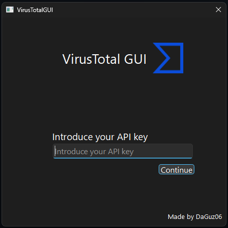
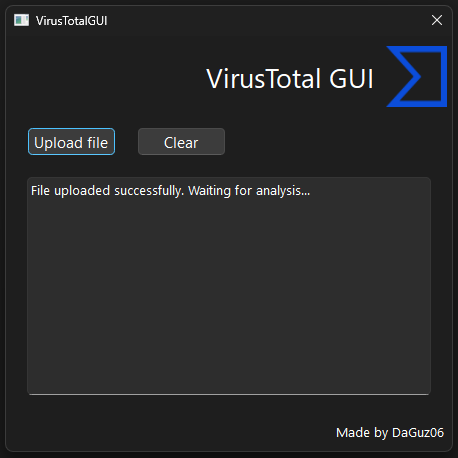
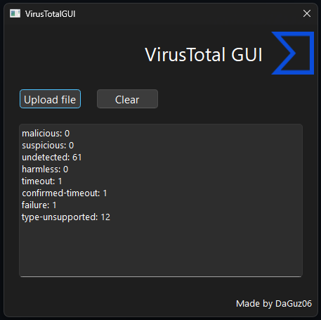

# VirusTotalGUI

A simple and intuitive GUI for [VirusTotal](https://www.virustotal.com) developed with Python and PyQt6.  
This application allows users to validate their API key, upload files, and see the analysis results directly in the interface.

---

## Features

- Validate your VirusTotal API key before using the app.
- Upload files to VirusTotal for analysis.
- View results directly in a read-only results panel.
- Clear results with a single click.
- Responsive GUI using PyQt6 and background threads (no freezing while analyzing).

---

## Requirements

- Python 3.10 or higher
- [PyQt6](https://pypi.org/project/PyQt6/)
- [Requests](https://pypi.org/project/requests/)
- (Optional) [pyqt6-tools](https://pypi.org/project/pyqt6-tools/) for Qt Designer and extra utilities

---

## Installation

Clone the repository and install the dependencies:

```bash
git clone <https://github.com/DaGuz06/VirusTotalGUI.git>
cd VirusTotalGUI
pip install PyQt6 requests pyqt6-tools
```

---

## Usage

1. Run the application:
```bash
python run.py
```
2. Enter your VirusTotal API key.

3. Click Continue to validate the API key.

4. Upload a file using Upload file.

5. Wait for the analysis to complete — results will appear in the results panel.

6. Click Clear to empty the results panel if needed.

---

## Screenshots








---

## Notes

- Make sure your API key is valid.

- Large files may take several seconds to analyze.

- The GUI uses background threads, so the interface remains responsive during analysis.
